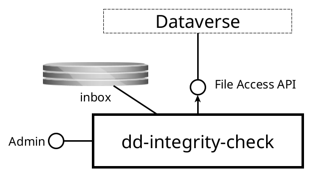

dd-integrity-check
=============

Service that checks the integrity of Dataverse datafiles

Purpose
-------
This service checks the integrity of Dataverse datafiles by comparing the expected checksum value from Dataverse with the actual checksum value calculated from
the file bytes. This is done to detect any data corruption that may have occurred during file transfers or storage. The service also keeps a record of the
checks performed, which can be used for monitoring and reporting purposes.

Interfaces
----------

This service has the following interfaces:

{width="70%"}

#### Inbox

* _Protocol type_: Shared filesystem
* _Internal or external_: **internal**
* _Purpose_: to receive a list of files to check

#### Admin console

* _Protocol type_: HTTP
* _Internal or external_: **internal**
* _Purpose_: application monitoring and management

### Consumed interfaces

#### Dataverse

* _Protocol type_: HTTP
* _Internal or external_: **internal**
* _Purpose_: to get file bytes from which to calculate the actual checksum.

Processing
----------
The service periodically scans the inbox for CSV files. Each row schedules at most one integrity check task, unless a task for the same file is already pending
or has run recently (based on the configured minimal frequency).

The CSV supports the following columns:

* `FILEID` (required) – Dataverse file id.
* `FILESIZE` (required) – file size in bytes.
* `CHECKSUM_TYPE` (required) - checksum algorithm, for example `MD5`, `SHA-1`, `SHA-256` or `SHA-512`.
* `CHECKSUM_VALUE` (required) – expected checksum value from Dataverse.
* `DATASET_PID` (optional) – dataset persistent identifier for reporting.
* `PUBLICATION_TIMESTAMP` (optional) - publication timestamp (ISO-8601 offset date-time or `yyyy-MM-dd HH:mm:ss[.SSS]`).

After successful parsing, the processed CSV file is moved to the outbox.

The executor picks up scheduled tasks during the configured execution window. For each task, the service downloads the Dataverse file in chunks, retries failed
chunk downloads, computes the checksum, and stores the result. The task is marked `FINISHED` when processing completes (with the checksum match result),
or `ERROR` when processing fails.
